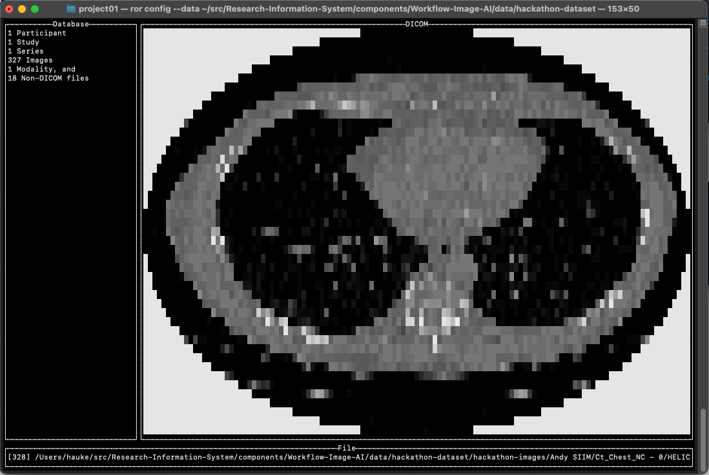

# A tool to create workflows for the research PACS

Integration of workflows into the research information system allows projects to react to events like new data arriving. A pipeline can be triggered based on these events and your code is run on matching datasets. Results are either tabulated data (added to REDCap) or new image data (added to the research PACS).

Using the ror tool you should be able to start developing and testing a workflow in a simulated research PACS. As a final step build and upload your workflow to the research PACS.

## Setup and first steps

Processing workflows are developed locally on your computer in a simulated research information system. The ror tool is used to emulate this system. In this simulation the ror tool provides the data to your workflow, starts the workflow and interpretes the result. Your workflow should have no other means to access data from outside your workflow. They will not exist if your workflow runs on the research information system.

The *ror* tool helps you to

- create a first project directory,
- find suitable DICOM files on your disc,
- trigger a processing task on the series, study or patient level, and
- build and test a containerized workflow package (in progress),
- create a package and submit to research information system (todo: automate).

A minimal workflow requires 8 commands to compute the signal-to-noise ratio of all DICOM series in our test data folder:

```bash
> ror init snr
> cd snr
> ror config --data ../data --temp_directory `pwd`
> ror trigger --keep
> ror build
> pip list --format=freeze > .ror/virt/requirements.txt
> docker build --no-cache -t workflow_snr -f .ror/virt/Dockerfile .
> ror trigger --keep --each --cont workflow_snr
```

Below is a window capture from one start to finish run of the tool. This workflow calculates the signal-to-noise ratio of each DICOM series. The movie assumes that we are already running in a clean virtual environment provided by conda.


### Install on MacOS

Download the ror executable. Copy the file to a folder like /usr/local/bin/ that is in your path. This will make it easier afterwards to work with the tool as you can use `ror` instead of the full path.

```bash
wget -qO- https://github.com/mmiv-center/Research-Information-System/raw/master/components/Workflow-Image-AI/build/macos-amd64/ror > /usr/local/bin/ror
chmod +x /usr/local/bin/ror
```

### Install on Windows

Download the ror.exe. Copy the program to your program files folder. The line below will only work in the cmd terminal and with administrator rights. If you don't have those rights copy the executable into one of your own directories and add that to the PATH environment variable in system settings.

```bash
wget -qO- https://github.com/mmiv-center/Research-Information-System/raw/master/components/Workflow-Image-AI/build/windows-amd64/ror.exe > %ProgramFiles%/ror.exe
```

### Install on Linux

Download the executable. Copy the file to a folder like /usr/local/bin/ that is in your path.

```bash
wget -qO- https://github.com/mmiv-center/Research-Information-System/raw/master/components/Workflow-Image-AI/build/linux-amd64/ror > /usr/local/bin/ror
chmod +x /usr/local/bin/ror
```

### Build it yourself

This project depends on go, goyacc, and make. Install goyacc with

```bash
go get -u golang.org/x/tools/cmd/goyacc
```
Use the provided Makefile to build ror for all three platforms.

## Create a first project

```bash
ror init project01
```

The above call will create a new directory project01. The directory contains a starter package of a certain type and a README.md. Init will also create a hidden .ror/config file that is used by ror to remember your settings and information about your project.


The available starter project types are currently:

- python: provides a vanilla python v3.8 stub.py that depends on pydicom, numpy and matplotlib. The example will load a DICOM series, convert them into numpy arrays and use matplotlib to show a multi-planar reconstruction.
- notebook: similar functionality to the "python" type with a jupyter notebook for development. The notebook overwrites the stub.py during deployment.
- bash: a shell script that depends on dcmtk, dcm2niix and jq. The example application converts all image series into Nifti and extract the matrix size from one of the DICOM files.
- webapp: a visualization environment providing a single page web-application

Now you have a folder for your project's source code. In order to develop our pipeline we will use another data folder with test DICOM images. Also, set the temporary directory to the current directory. This will ensure we can see the data folder provided to the workflow.

```bash
cd project01
ror config --data ./data --temp_directory `pwd`
```



Notice: In order to speed up testing you should not have too many DICOM files in the data directory. Specify a subset of the folders in the data directory by using double quotes (prevents the shell from interpreting your path) and the special glob-characters '*' and '[]'. For example you can select all sub-folders in ./data that start with 006 up to and including 009 with `--data "./data/00[6-9]*"` (double quotes are important here to prevent the shell from replacing the value prematurely).

Use the status command to see the current settings of your project. This call will simply print out the hidden config file in the .ror directory.

```bash
ror status
```

Status can also be used to review the selected image series with a basic text user interface:

```bash
ror status --tui
```


To simulate what the system does for testing purposes we 'trigger' the processing of a DICOM series by

```bash
ror trigger --keep
```

This call will create a new folder in the temp system folder (change with `ror config --temp_directory <new location>`). Inside that folder ror creates a copy of the selected image series (input/ folder). Using '--keep' option the folder will stay around after processing instead of being deleted. Any messages produced by the processing pipeline will end up in a 'log/' folder. Any output generated should be placed in the 'output/' folder. Here is an example folder structure after processing.

```
ror_trigger_run_Thursday_269448975
├── descr.json
├── input
│   ├── 000000.dcm
│   ├── 000001.dcm
│   ├── 000002.dcm
│   ├── 000003.dcm
│   ├── 000004.dcm
│   ├── 000005.dcm
│   ├── 000006.dcm
│   ├── 000007.dcm
│   ├── 000008.dcm
│   ├── 000009.dcm
│   ├── 000010.dcm
│   ├── 000011.dcm
│   ├── 000012.dcm
│   ├── 000013.dcm
│   ├── 000014.dcm
│   └── 000015.dcm
├── input_view_dicom_series
│   └── TCGA-BA-4077SIIM^Neela            # PatientID_PatientName
│       └── 19960514_125626.308000        # StudyDate_StudyTime
│           └── 607_CORONALS<MPR\ Range>  # SeriesNumber_SeriesDescription
│               ├── 000000.dcm -> ../../../../input/000000.dcm
│               ├── 000001.dcm -> ../../../../input/000001.dcm
│               ├── 000002.dcm -> ../../../../input/000002.dcm
│               ├── 000003.dcm -> ../../../../input/000003.dcm
│               ├── 000004.dcm -> ../../../../input/000004.dcm
│               ├── 000005.dcm -> ../../../../input/000005.dcm
│               ├── 000006.dcm -> ../../../../input/000006.dcm
│               ├── 000007.dcm -> ../../../../input/000007.dcm
│               ├── 000008.dcm -> ../../../../input/000008.dcm
│               ├── 000009.dcm -> ../../../../input/000009.dcm
│               ├── 000010.dcm -> ../../../../input/000010.dcm
│               ├── 000011.dcm -> ../../../../input/000011.dcm
│               ├── 000012.dcm -> ../../../../input/000012.dcm
│               ├── 000013.dcm -> ../../../../input/000013.dcm
│               ├── 000014.dcm -> ../../../../input/000014.dcm
│               └── 000015.dcm -> ../../../../input/000015.dcm
├── log
│   ├── stderr.log
│   └── stdout.log
└── output
    └── output.json
```

Whereas all selected DICOM files appear in the input folder there is another folder "input_view_dicom_series/" with a directory structure that shows DICOM files that belong together. We would like to support additional views in the future - contact us if you have any ideas. For example a view that provides the DICOM data as Nifti or one that exports them as PNG? Currently this can be done inside the workflow (see the project type bash).

### Integration into the research PACS

The next step is to capture the setup of your machine so that we can re-create it inside the research information system. The last step is to publish the workflow to the research information system, which will ensure that the pipeline is run automatically for every incoming dataset.

To capture the setup run:

```bash
ror build
```

which will inform you of the basic steps to a) capture your dependent libraries and b) create a container based on those requirements. This step might not be trivial because it depends on a perfect copy of your local environment inside the container. Usually its best to start with a virtualized environment as explained by the `ror build` output.

For testing the containerized workflow on all your data you can trigger using the `--cont <workflow>` option specifying your container name:

```bash
ror trigger -keep --each --cont workflow_project01
```

After this last step we have a containerized workflow that accepts and processes data provided by the research information system. The specification of the container needs to be submitted to a workflow slot for your project. Such a workflow slot can be obtained from the user page of the Research Information System. Store the key in your project with

```bash
ror config --token "<token>"
```

### Specify a subset of the image series for processing

If your processing pipeline depends on specific image series you can filter out all other series. The ror program will only call your workflow with image series that match. There are two steps to create a filter. In a first step you can teach ror how to classify your image series. Afterwards you simply specify the class as a `--select`.

Basic classification information (classify rules) are added to the data description (descr.json) file as ClassifyTypes. This information comes from a .ror/classifyTypes.json file generated by ror during the init process. New classes for DICOM files can be added here. To explain the syntax lets look at the first type in the file called "GE":

```json
  {
    "type": "GE",
    "id": "GEBYMANUFACTURER",
    "description": "This scan is from GE",
    "rules": [
      {
        "tag": [
          "0x08",
          "0x70"
        ],
        "value": "^GE MEDICAL"
      }
    ]
  },
```

The class matches with any imaging studies from a General Electric (GE) scanner by checking if the value of the DICOM tag (0008,7000) matches with the regular expression "^GE MEDICAL" (starts with "GE MEDICAL"). Classifications can contain more than one matching tag (rules array). They can also contain rules that reference other rules. Here an example of a class that attempts to identify diffusion weighted image series from a Siemens scanner by scanning for 2 matching rules.

```json
  {
    "type": "DIFFUSION",
    "id": "DIFFUSION",
    "description": "SIEMENS diffusion weighted",
    "rules": [
      {
        "tag": [
          "SequenceName"
        ],
        "value": "*ep_b",
        "operator": "contains"
      },
      {
        "rule": "SIEMENSBYMANUFACTURER"
      }
    ]
  }
```

In general, classification rules will be site-based for many research projects. We might attempt to create a sufficiently large rule set to identify the default scan types from commercial vendors but any sequence programming will result in cases that might not be classified correctly using a given set of rules in classifyTypes.json.

### Simple glob-like series selection

To configure what image series are processed define a search filter like the following (all series with the DICOM tag SeriesNumber starting with "2")

```bash
ror config --select "SeriesNumber: 2"
```

This search text, a regular expression, is matched for each series against a string that contains

```bash
"StudyInstanceUID: %s, SeriesInstanceUID: %s, SeriesDescription: %s, NumImages: %d, SeriesNumber: %d, SequenceName: %s, Modality: %s, Manufacturer: %s, ManufacturerModelName: %s, StudyDescription: %s, ClassifyType: %s"
```

where ClassifyType is a comma separated array of detected classification types. To identify the diffusion scans from above the series filter could look like this (glob style filter):

```bash
ror config --select "ClassifyType: .*DIFFUSION"
```

### More complex input data selections using select

Analysis workflows might depend on more than an individual image series. If we do a longitudinal analysis all time points for a patient need to be available for analysis (patient level processing). This is also of interest if we require more than one image series, for example a fieldmap and a functional scan, or an anatomical T1 and a FLAIR scan from the same study (study level processing). The above glob-style filter will not work in these cases as it only provides a single matching image series as input to the workflow.

To generate sets of image data that are more complex than single specific image series a more complex selection language can be used. This language allows us to specify a unit of processing as complex as "a diffusion image series with a closest in time T1-weighted image series", or "all resting state image series with a suitable field map", or "all T1 weighted image series in the study from the first time point by patient, use the best quality scan if there is more than one for a patient". Based on the use-case we distinguish:

- Series level processing where a dataset contains all images of a DICOM series or volume
- Study level processing where a dataset contains all series of a single participant visit
- Patient level processing where a dataset contains all series for all studies for one participant
- Project level processing  where a dataset contains all data of a project

The later case is used to train an AI algorithm whereas the first and second are used for prediction. Patient level processing is suitable for longitudinal analysis.

You can use ror to suggest a selection on the series level. This call might take a long time if you have lots of data as it tries to randomly generate a 'good' selection that will create many series level datasets.

```bash
ror config --suggest
100/100 1.999
Suggested abstract syntax tree for your data [1.999383]
{
  "Output_level": "series",
  "Select_level": "series",
  "Select_level_by_rule": [
    "series"
  ],
  "Rule_list_names": [
    "no-name"
  ],
  "Rules": [
    [
      {
        "tag": [
          "Modality"
        ],
        "tag2": null,
        "value": "CR",
        "operator": "contains",
        "negate": "",
        "rule": ""
      }
    ]
  ],
  "CheckRules": null
}
To use this select statement call:
ror config --select '
SELECT series
  FROM study
    WHERE series NAMED "no-name" HAS
       Modality containing CR
'

We will run processing on any single image series that matches.
We will select cases with a single matching image series.

Given our current test data we can identify 9721 matching datasets.
```

In the above example the best rule that was found simply selectes all series based on the modality (CR).

For now I end up with what I know, an SQL-like grammar :-/. This is working right now (newlines and formatting are superfluous):

```bash
ror config --select '
Select patient
  from study
    where series named "T1" has
      ClassifyType containing T1 
    and 
      SeriesDescription regexp "^A" 
  also
    where series named "DIFF" has
      ClassifyType containing DIFFUSION
  also
    where series named "REST" has 
      ClassifyType containing RESTING 
    and 
      NumImages > 10  
    and 
      not(NumImages > 200)
'
```

Limitations: i) The 'not' operator only works on the level of individual rules. ii) There is support for braces '(', ')', but that is not very useful at the moment - maybe for 'not'. iii) There is no 'or' compared to the 'and'. iv) There is a way to specify dependencies between series with 'check' but such dependencies are not yet enforced (such as 'same FrameOfReferenceUID').


### Details on select as a language to specify input datasets

The selection (domain specific) language first specifies a level at which the data is exported ('Select patient'). If processing depends on a single series only a 'Select series' will export a single random image series. If 'Select study' is used (default) all matching series of a study are exported. The 'from study' is not functional at the moment. In the future it is supposed to allow a construct like 'from earliest PROJECT_NAME by StudyDate as DICOM'. The third part is a list of where clauses delimited by 'also where series has' to separate selection rules for different series like one for a field map and another for a resting state scan. A where clause selecting a series can be named using the optional "named SOMENAME". This name will be available to the workflow to help identify the individual image series types. Each where clause is a list of rules that use the tags available for each series (ror status). Only tags from 'ror status' work. If a new tag needs to be included, which is not yet part of the series information provided by 'ror status' add the tag first to a new classify rule. Afterwards the new tag referencing that rule appears in ClassifyTypes and can be used in select (`ClassifyType containing <new type>`).

The possible syntax for rules is:

- `<field> containing <string>` check if the field list contains the specified string. A usual example is the field ClassifyTypes which is a list of types like "T1" or "DIFFUSION". The string needs to be in double quotes if it contains spaces.
- `<field> == <string>` compare if every entry of the field is truly equal to the specified string.
- `<field> < <num>` match if the field is a number field (SeriesNumber, NumImages) and smaller than the provided numeric value.
- `<field> > <num>` match if the field is a number field (SeriesNumber, NumImages) and larger than the provided numeric value.
- `<field> approx <string>` match if all entries in the field are numerically similar (1e-4) to the corresponding comma separated string values provided. This might not be very useful in the provided context but matches with the classifyRules.json definitions used for example for the detection of axial, sagittal and coronal scan orientations.
- `<field> regexp <string>` match the field with the provided regular expression. For example "^GE" would match with values that start with "GE", or "b$" matches with all strings that end with the letter "b", or "patient[6-9]" matches with all strings that have a 6, 7, 8, or 9 after "patient".

where `<field>` can be any of the following `[SeriesDescription|NumImages|SeriesNumber|SequenceName|Modality|StudyDescription|Manufacturer|ManufacturerModelName|PatientID|PatientName|ClassifyTypes]`.

Notice: It is now possible to reference any DICOM tag of an image. In order to support this feature an 'ALL'-section has been added for each series that contains the DICOM tags of the first image of each series. An arbitrary tag can be referenced using the '(0000,0000)' notation of group and tag.

### Select use-case: training a model

In order to train a model access to all the data is required. That means that the selection level has to be 'project'. Define a filter with

```bash
ror config --select '
  Select project       /* export level for all data in the study */
    from study         /* not functional */
      where series has /* start of a rule set */
        Modality = CT  /* selection rule */
'
```

This data selection will create at most one matching dataset, a single input folder with all (modality CT) image series for all participants and studies in the project.

### Select use-case: prediction on a single matching image series

Selection for individual image series should be done on the 'series' level with 'Select series ...'.

```bash
ror config --select '
  Select series       /* export level for a single image series */
    from study        /* not functional */
      where series has  /* start of a rule set */
        Modality = CT   /* selection rule */
      and
        NumImages > 100 /* numeric rule for number of slices in series */
'
```

### Select use-case: dependencies between series in a study

If 2 selected series in a study should share the same FrameOfReferenceUID (can be fused without registration) such a check can be enforced by adding a 'CHECK' section with rules that reference the named series from Select.

```bash
ror config  --select '
  Select study 
    from project
      where series named COR has
        ClassifyType containing coronal
    also
      where series named AX has
        ClassifyType containing axial
  Check
      COR@FrameOfReferenceUID = AX@FrameOfReferenceUID
    AND
      COR@Modality = AX@Modality
'
```

### Using select in the workflow

For select all image series that match are in a pool of potential datasets for the 'trigger' command. There is the option to run a single random dataset of them with `ror trigger`, or to run all of the possible datasets in a row with `ror trigger --each`. For testing of workflows it is suggested to start with:

```bash
ror trigger --keep
```

which will keep the input data to the workflow around after the trigger has finished. By default (without '--keep') all data folders are deleted after a single run. Fix any problems found with your workflow given that dataset. Do not change the content of the data folder only adjust your program. To test if your updated workflow works on the last dataset use

```bash
ror trigger --last
```

Once you workflow seems ok test with another random dataset using `ror trigger --keep` or simply try to run the workflow on all datasets with `ror trigger --each`.

## Acknowlegements

This project depends on other software. It is written in golang - thanks to the developers and maintainers of that language. The project uses docker as a container environment, conda/pip to help with creating encapsulated workflows, the github.com/suyashkumar/dicom library to handle raw data and lots of inspiration from git on how to create a support tool for complex workflows.
