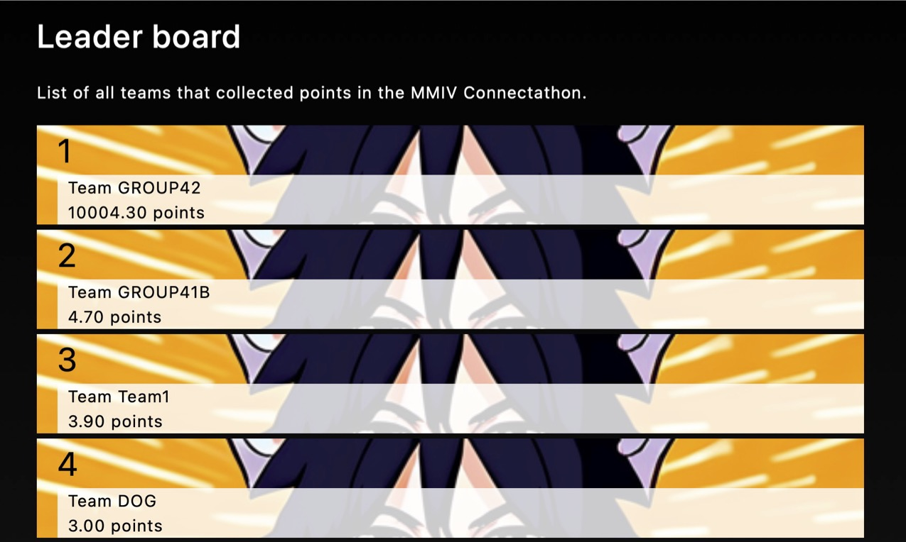

!(Title image)[assets/img/Title.png]

# NekoMed - MMIV Connectathon, a competion system for image-based AI systems

This part of the repository contains a competion system used in the 2023 Tromsø workshop on image-based AI system in hospitals. The competition took 1 1/2 hours. Groups successful during this period continued afterwards as long as the router was kept plugged in.




## Setup

We used a cheap router plugged into a power outlet in the middle of the room. Such a system is sufficient for about 100 people. In our competition we had about 15 active participants; groups successfully connecting to the network. 

Notice: The next time we run this competition we need to fix at least the IP of the first laptop. This can be done by setting the range of DHCP addresses for all the participants and selecting a fixed address outside that range for the machine running the competition site.

A laptop connected first to the router and hosted this folder.

Serve the local index.php from a php server on a port such as 4444. You will need to replace "localhost" with the IP address of the hosting machine once you are connected to the competition network.

```bash
cd NekoMed
php -S localhost:4444
```

```bash
cd php
watch -n 2 ./sendOutData.sh
```

## Client

Connect to the network and Navigate to the website:

```
http://<IP competition machine>:4444/
```

Example of the call a participant needs to come up with:

```bash
cd php
storescp -aet "DOG" \
         --sort-on-study-uid "MYDATA" \
         --eostudy-timeout 16 \
         --exec-sync \
         --exec-on-eostudy "/Users/haukebartsch/src/Research-Information-System/documentation/NekoMed/php/process.py #r #a #c #p" \
         -od "/tmp/" \
         -fe ".dcm" \
         11114
```

